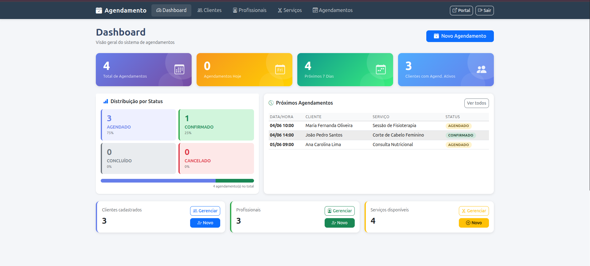
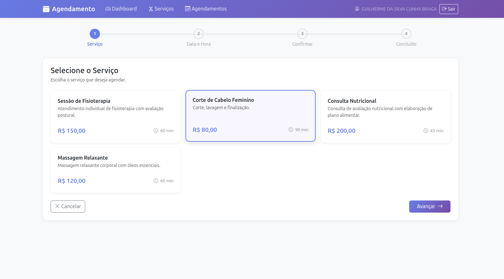

# Sistema de Agendamento de Serviços

> Trabalho de Conclusão de Curso — Engenharia de Software, UNDB 2026  
> **Autor:** Guilherme Braga · **Orientador:** Prof. Rodrigo Justino

Aplicação web full-stack para gestão de agendamentos de serviços, composta por uma **API REST**, um **painel administrativo** e um **portal de autoatendimento do cliente**, todos compartilhando a mesma base de regras de negócio e persistência.

---

## Sumário

- [Visão Geral](#visão-geral)
- [Funcionalidades](#funcionalidades)
- [Stack Tecnológica](#stack-tecnológica)
- [Arquitetura](#arquitetura)
- [Telas do Sistema](#telas-do-sistema)
- [Diagramas](#diagramas)
- [Como Executar](#como-executar)
- [URLs Disponíveis](#urls-disponíveis)
- [Credenciais de Desenvolvimento](#credenciais-de-desenvolvimento)
- [API REST](#api-rest)
- [Testes](#testes)
- [Qualidade de Código](#qualidade-de-código)
- [Licença](#licença)

---

## Visão Geral

O sistema resolve o problema de gestão manual de agendamentos em negócios de prestação de serviços (salões, clínicas, estúdios, etc.). Permite que gestores administrem clientes, profissionais e serviços por um painel web, enquanto os próprios clientes podem agendar e acompanhar atendimentos pelo portal de autoatendimento, sem necessidade de ligação ou presença física.

---

## Funcionalidades

### Painel Administrativo (`/dashboard`)
- Cadastro, edição e remoção de **clientes**, **profissionais** e **serviços**
- Criação e gestão de **agendamentos** com validação de conflito de horário
- Transição de status: `AGENDADO → CONFIRMADO → CONCLUIDO` (ou `CANCELADO`)
- Busca e filtragem em todas as listagens
- Dashboard com métricas em tempo real (totais, agendamentos do dia, gráficos)

### Portal do Cliente (`/portal`)
- Cadastro e login com autenticação por sessão
- Agendamento em fluxo guiado: escolha de serviço → profissional → data/hora
- Histórico de agendamentos com status atualizado
- Cancelamento de agendamentos futuros

### API REST (`/api/v1/`)
- Autenticação via JWT
- CRUD completo de todas as entidades
- Controle de acesso por papel (`ROLE_USER`, `ROLE_ADMIN`)
- Documentação automática via Swagger UI

---

## Stack Tecnológica

| Tecnologia | Versão | Papel |
|---|---|---|
| Java | 21 (LTS) | Linguagem principal |
| Spring Boot | 4.0.5 | Framework base + servidor embutido |
| Spring Web MVC | — | Camada REST e MVC |
| Spring Data JPA + Hibernate | — | Persistência e ORM |
| Spring Security | — | Autenticação e autorização |
| JJWT | 0.12.3 | Tokens JWT para a API REST |
| Thymeleaf | — | Templates HTML server-side |
| Bootstrap | 5.3.3 | Estilização das interfaces |
| SpringDoc OpenAPI | 2.8.6 | Documentação automática (Swagger UI) |
| H2 Database | — | Banco em memória (dev/testes) |
| MySQL Connector | — | Driver para banco persistente (produção) |
| Lombok | — | Redução de boilerplate |
| JUnit 5 + Mockito | — | Testes unitários e de integração |
| Maven | 3.9.x | Build e dependências |
| GitHub Actions + Qodana | — | CI e análise estática de qualidade |

---

## Arquitetura

O projeto segue arquitetura em camadas dentro de um único módulo Spring Boot:

```
com.guilhermebraga.agendamento_api/
├── controller/          # Controllers REST (@RestController) — respostas JSON
├── controller/web/      # Controllers MVC do painel administrativo
├── controller/portal/   # Controllers MVC do portal do cliente
├── service/             # Regras de negócio (validações, transições de estado)
├── repository/          # Interfaces Spring Data JPA + consultas JPQL
├── entity/              # Entidades JPA mapeadas para as tabelas
├── dto/request/         # Objetos de entrada com Bean Validation
├── dto/response/        # Objetos de saída serializados para JSON/template
├── dto/form/            # Formulários de agendamento multi-etapa (@SessionAttributes)
├── mapper/              # Conversão entidade ↔ DTO
├── security/            # Filtro JWT, provedor de tokens e configurações
├── exception/           # Exceções de domínio e GlobalExceptionHandler
└── config/              # SecurityConfig, OpenApiConfig, configurações MVC
```

### Modelo de Domínio

| Entidade | Descrição |
|---|---|
| `Cliente` | Pessoa que realiza agendamentos; possui e-mail, CPF e senha (BCrypt) |
| `Profissional` | Prestador do serviço com especialidade |
| `Servico` | Tipo de atendimento com nome, duração em minutos e preço |
| `Agendamento` | Associa cliente + profissional + serviço + data/hora; controla o ciclo de vida |

### Ciclo de Vida do Agendamento

```
        criar
          ↓
      AGENDADO ──────────────────────→ CANCELADO
          │
   admin confirma
          ↓
     CONFIRMADO ────────────────────→ CANCELADO
          │
    admin conclui
          ↓
      CONCLUIDO  (estado terminal)
```

> A verificação de conflito de horário usa JPQL com algoritmo de overlap de intervalos (`dataHoraFim` calculado e persistido). Apenas agendamentos `AGENDADO` ou `CONFIRMADO` bloqueiam o horário.

---

## Telas do Sistema

### Painel Administrativo

#### Dashboard


#### Listagem de Agendamentos


#### Novo Agendamento


#### Alterar Status do Agendamento


#### Listagem de Clientes


#### Listagem de Profissionais


#### Listagem de Serviços


#### Documentação — Swagger UI


---

### Portal do Cliente

#### Tela de Identificação / Login


#### Cadastro de Cliente


#### Home do Portal


#### Fluxo de Agendamento — Escolha do Serviço


#### Fluxo de Agendamento — Escolha do Profissional


#### Fluxo de Agendamento — Escolha da Data/Hora


#### Confirmação do Agendamento


#### Meus Agendamentos


---

## Diagramas

#### Diagrama de Classes


#### Diagrama Entidade-Relacionamento (ER)


#### Diagrama de Casos de Uso


#### Diagrama de Sequência — Fluxo de Agendamento


#### Arquitetura do Sistema


---

## Como Executar

### Pré-requisitos

- **Java 21** ou superior — [Adoptium](https://adoptium.net/)
- **Git**
- Maven Wrapper incluído (não requer instalação separada do Maven)

### Passos

```bash
# 1. Clonar o repositório
git clone https://github.com/engguilhermebraga/agendamento-api.git
cd agendamento-api/agendamento-api

# 2. Executar no perfil de desenvolvimento (banco H2 em memória)
./mvnw spring-boot:run

# 3. Executar os testes
./mvnw test
# Esperado: Tests run: 138, Failures: 0, Errors: 0, Skipped: 0
```

> O `DataInitializer` popula automaticamente o banco com clientes, profissionais, serviços e agendamentos de exemplo ao subir o servidor.

---

## URLs Disponíveis

| Recurso | URL |
|---|---|
| Painel administrativo | http://localhost:8081/dashboard |
| Portal do cliente | http://localhost:8081/portal |
| Swagger UI | http://localhost:8081/swagger-ui.html |
| OpenAPI JSON | http://localhost:8081/api-docs |
| Console H2 | http://localhost:8081/h2-console |

---

## Credenciais de Desenvolvimento

### Painel Administrativo (Form Login)

| Usuário | Senha | Papel |
|---|---|---|
| `admin` | `admin123` | ROLE_ADMIN |
| `user` | `user123` | ROLE_USER |

### Portal do Cliente

Qualquer cliente criado pelo `DataInitializer` com senha `cliente123`.

### API REST — Obter Token JWT

```bash
curl -X POST http://localhost:8081/api/v1/auth/login \
  -H "Content-Type: application/json" \
  -d '{"username":"admin","password":"admin123"}'
```

Usar o token retornado no header de todas as requisições protegidas:

```
Authorization: Bearer <token>
```

---

## API REST

Base: `/api/v1/`

| Recurso | Operações | Acesso mínimo |
|---|---|---|
| `POST /auth/login` | Autenticar, obter JWT | Público |
| `GET /clientes` | Listar todos | USER |
| `POST /clientes` | Cadastrar | ADMIN |
| `GET /clientes/{id}` | Buscar por ID | USER |
| `PUT /clientes/{id}` | Atualizar | ADMIN |
| `DELETE /clientes/{id}` | Remover | ADMIN |
| `GET /profissionais` | Listar todos | USER |
| `POST /profissionais` | Cadastrar | ADMIN |
| `PUT /profissionais/{id}` | Atualizar | ADMIN |
| `DELETE /profissionais/{id}` | Remover | ADMIN |
| `GET /servicos` | Listar todos | USER |
| `POST /servicos` | Cadastrar | ADMIN |
| `PUT /servicos/{id}` | Atualizar | ADMIN |
| `DELETE /servicos/{id}` | Remover | ADMIN |
| `GET /agendamentos` | Listar (filtros: status, data) | USER |
| `POST /agendamentos` | Criar | USER |
| `PUT /agendamentos/{id}` | Atualizar | ADMIN |
| `PATCH /agendamentos/{id}/status` | Transição de status | ADMIN |
| `DELETE /agendamentos/{id}` | Remover | ADMIN |

> Documentação interativa completa disponível em `/swagger-ui.html`.

---

## Testes

```bash
./mvnw test
```

**138 testes** distribuídos em 4 camadas:

| Camada | Ferramenta | Escopo |
|---|---|---|
| Unitária | JUnit 5 + Mockito | Serviços em isolamento total |
| Repositório | JUnit 5 + H2 real | Consultas JPQL com rollback automático |
| Controlador | MockMvc + @WithMockUser | Status HTTP, serialização e controle de acesso |
| Integração | MockMvc + H2 real | Fluxo completo criação → transições de status |

---

## Qualidade de Código

O projeto usa [Qodana](https://www.jetbrains.com/qodana/) via GitHub Actions para análise estática automatizada a cada push e pull request. O workflow está em `.github/workflows/qodana_code_quality.yml`.

---

## Configuração para Produção (MySQL)

Criar `application-prod.properties` (não versionar):

```properties
spring.datasource.url=jdbc:mysql://host:3306/agendamento_db
spring.datasource.username=${DB_USER}
spring.datasource.password=${DB_PASSWORD}
spring.jpa.hibernate.ddl-auto=validate
jwt.secret=${JWT_SECRET}
```

---

## Licença

MIT License — Copyright (c) 2026 Guilherme Braga
