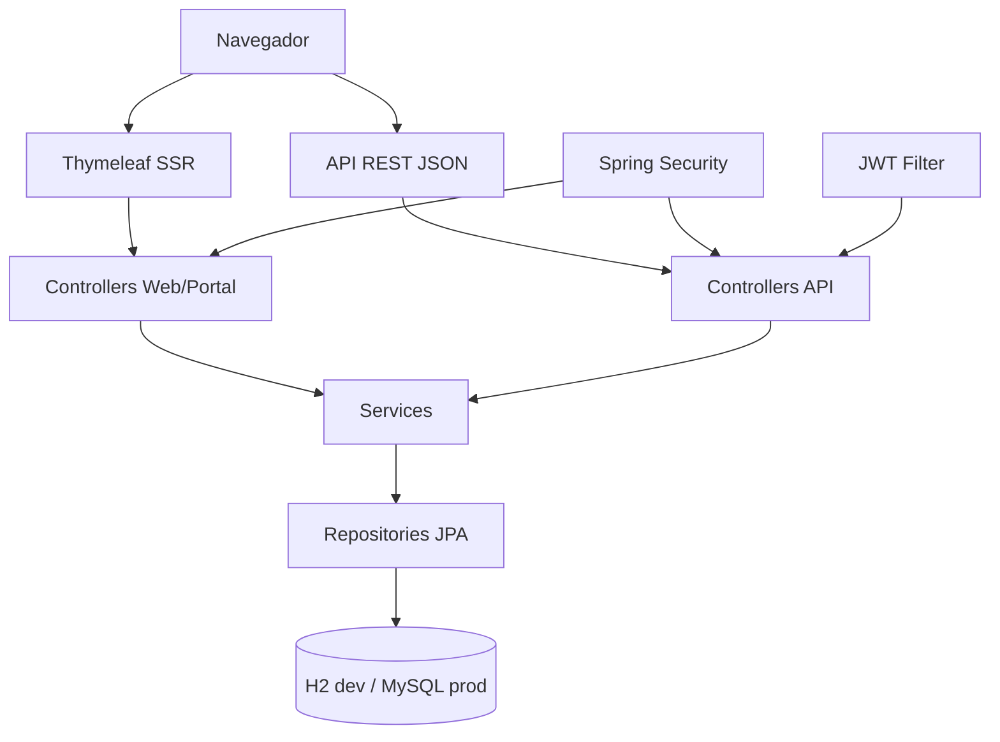
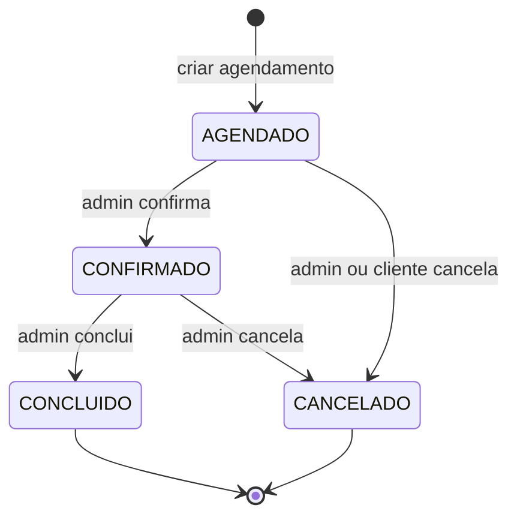
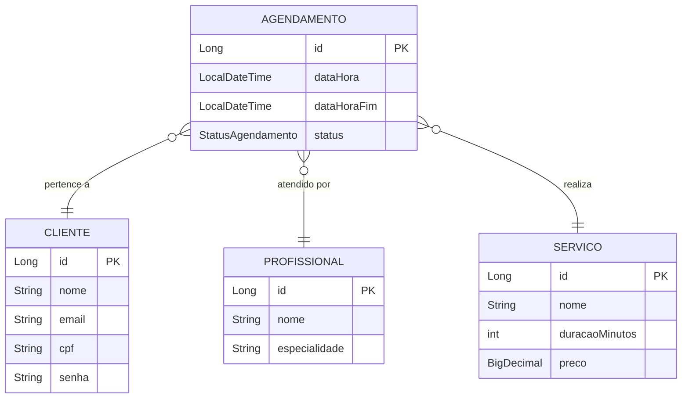
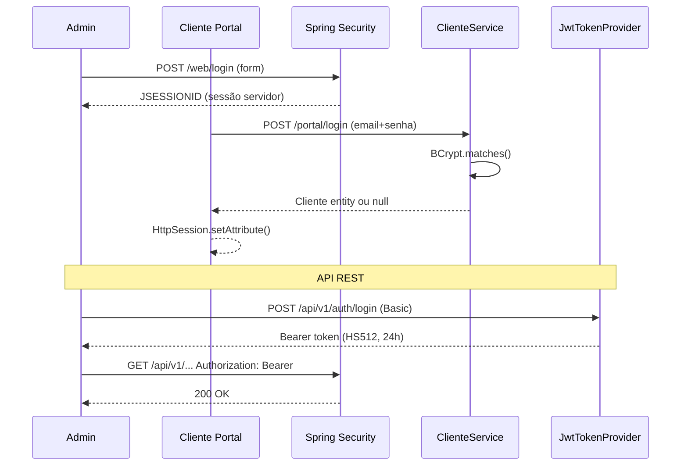
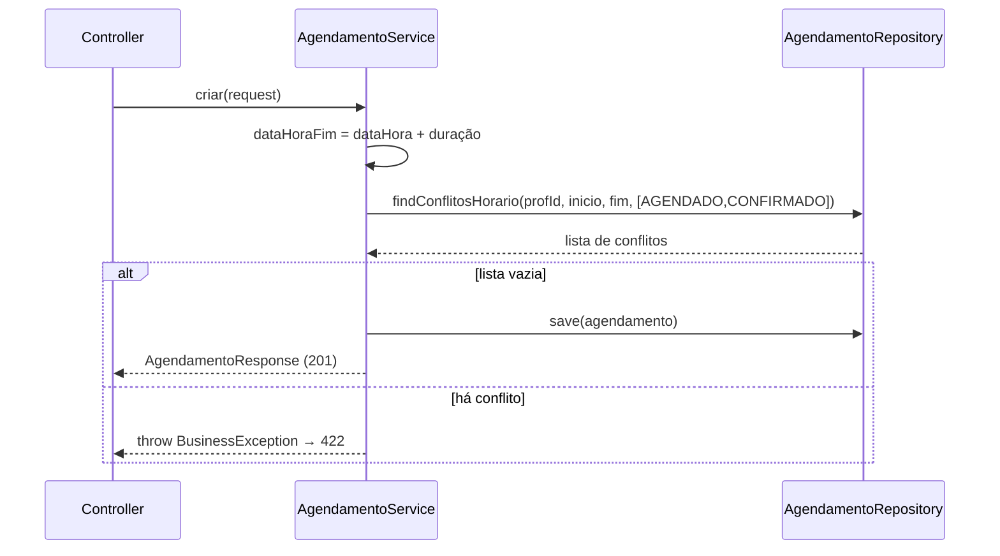

# RELATÓRIO DE DESENVOLVIMENTO — Sistema de Agendamento
## Documento base para escrita dos capítulos finais do TCC
### UNDB — Engenharia de Software | Guilherme Braga | 2026

> **Instruções:** Cole este documento no Claude Projects junto com o `compilado_tcc.md`.
> Escreva os capítulos na primeira pessoa, como desenvolvedor. Toda informação aqui
> está verificada no código-fonte. Não invente dados — use exatamente o que está descrito.

---

## PARTE 1 — METODOLOGIA

### 1.1 Método de Desenvolvimento Adotado

O projeto foi desenvolvido sob a metodologia **iterativa e incremental**, com ciclos curtos de desenvolvimento, teste e integração. Cada funcionalidade foi implementada em uma branch separada, submetida como Pull Request e integrada ao branch principal somente após a aprovação do pipeline de integração contínua (CI).

O controle de versão seguiu o **GitHub Flow**: um branch `main` sempre estável, branches de funcionalidade com nomenclatura descritiva e Pull Requests como ponto único de revisão antes da integração.

**Ferramentas utilizadas no controle de versão:**
- Git para controle local
- GitHub para repositório remoto e Pull Requests
- GitHub Actions para CI automático (build + testes + análise estática)
- Qodana (JetBrains) para análise estática de código Java

### 1.2 Ciclo de cada incremento

1. Identificação da funcionalidade ou correção
2. Criação de branch de funcionalidade
3. Implementação e testes unitários/integração locais (`mvn test`)
4. Push e abertura de Pull Request
5. Execução automática do CI (build + 138 testes + Qodana)
6. Correção de problemas identificados pelo CI
7. Merge ao branch `main`

### 1.3 Planejamento Visual da Interface

O planejamento visual não utilizou ferramentas de prototipagem como Figma. A decisão de projeto foi realizar o design diretamente no código, utilizando o sistema de componentes do Bootstrap 5 como base e refinando a interface iterativamente. Essa abordagem é denominada *design in-code* e é comum em projetos onde o desenvolvedor acumula as funções de designer e implementador, eliminando a etapa de transferência entre protótipo e código.

A consistência visual foi garantida por:
- **Bootstrap 5.3.3**: grid de 12 colunas, paleta semântica, componentes padronizados
- **Bootstrap Icons 1.11.3**: ícones SVG para todos os elementos de navegação e ação
- **Variáveis CSS personalizadas** (`static/css/style.css`): paleta de identidade do sistema
- **Fragmentos Thymeleaf compartilhados**: `layout/base.html` (admin) e `portal/layout.html` (portal) garantem navbar, alertas e rodapé idênticos em todas as telas de cada ambiente

**Paleta de cores do sistema:**

| Elemento | Cor | Hex |
|---|---|---|
| Gradiente navbar/hero | Violeta → Roxo | `#667eea → #764ba2` |
| Status AGENDADO | Azul-violeta | `#667eea` |
| Status CONFIRMADO | Verde Bootstrap | `#28a745` |
| Status CONCLUÍDO | Cinza Bootstrap | `#6c757d` |
| Status CANCELADO | Vermelho Bootstrap | `#dc3545` |
| Metric card Total | Gradiente roxo | `linear-gradient(135deg, #667eea, #764ba2)` |
| Metric card Hoje | Gradiente rosa | `linear-gradient(135deg, #f093fb, #f5576c)` |
| Metric card 7 dias | Gradiente azul | `linear-gradient(135deg, #4facfe, #00f2fe)` |
| Metric card Clientes | Gradiente verde | `linear-gradient(135deg, #43e97b, #38f9d7)` |

### 1.4 Ferramentas de Desenvolvimento

| Ferramenta | Uso |
|---|---|
| IntelliJ IDEA | IDE principal de desenvolvimento Java |
| Maven 3.x | Gerenciador de dependências e build |
| Git + GitHub | Controle de versão e repositório remoto |
| GitHub Actions | CI: build, testes e Qodana automáticos em cada PR |
| Qodana | Análise estática de código Java (bulk operations, nullability) |
| Swagger UI | Documentação e teste interativo da API REST |
| H2 Console | Inspeção do banco em memória durante desenvolvimento |

---

## PARTE 2 — DESENVOLVIMENTO DO SISTEMA

### 2.1 Visão Geral da Arquitetura

O sistema foi construído sobre a arquitetura **MVC em camadas** do Spring Boot, com separação clara de responsabilidades:

```
Navegador / Cliente HTTP
  └─ Camada de Apresentação
       ├─ Thymeleaf (SSR — telas admin e portal do cliente)
       └─ JSON REST (API para integrações externas)
            └─ Camada de Controllers (Spring MVC)
                 └─ Camada de Serviços (regras de negócio)
                      └─ Camada de Repositórios (Spring Data JPA)
                           └─ Banco de Dados (H2 em dev / MySQL em produção)
```

**Decisão arquitetural — SSR vs SPA:**
Optou-se por Thymeleaf (Server-Side Rendering) em vez de frameworks SPA (React, Angular) porque o domínio do sistema — agendamentos com fluxos lineares — não exige reatividade complexa. O SSR simplifica o deploy, elimina uma camada de API separada para as telas internas e facilita a validação de formulários com `BindingResult` do Spring MVC.

**Dois ambientes visuais independentes:**
- **Painel administrativo** (`/web/**`, `/dashboard`): protegido por Spring Security, voltado ao operador interno
- **Portal do cliente** (`/portal/**`): público, autenticação opcional por `HttpSession`, voltado ao cliente final

### 2.2 Tecnologias Utilizadas

| Tecnologia | Versão | Papel no sistema |
|---|---|---|
| Spring Boot | 4.0.5 | Framework base, servidor Tomcat embutido, auto-configuração |
| Spring MVC | (incluso) | Controllers, roteamento HTTP, binding de formulários |
| Spring Security | (incluso) | JWT para API REST, HTTP Basic como fallback, proteção de rotas |
| Spring Data JPA | (incluso) | Repositórios, queries JPQL customizadas |
| Hibernate | (incluso) | ORM, geração de DDL automático |
| H2 | (incluso) | Banco em memória para desenvolvimento e testes |
| MySQL Connector | — | Conector para banco de produção (configurado no POM) |
| Thymeleaf | 3.x | Motor de templates SSR, fragmentos, layouts parametrizados |
| Bootstrap | 5.3.3 | Grid responsivo, componentes UI, utilitários CSS |
| Bootstrap Icons | 1.11.3 | Ícones SVG via fonte CDN |
| JJWT | 0.12.3 | Geração e validação de tokens JWT (algoritmo HS512) |
| SpringDoc OpenAPI | 2.8.6 | Swagger UI automático em `/swagger-ui.html` |
| Lombok | — | Redução de código boilerplate (`@Data`, `@Builder`, `@Slf4j`) |
| BCrypt | — | Hash de senhas para admin e clientes do portal |
| Maven | 3.x | Build, dependências, execução de testes |
| Qodana | — | Análise estática integrada ao GitHub Actions |

### 2.3 Modelagem de Dados

**Entidades JPA implementadas:**

**`Cliente`**
```
id (PK, auto), nome (varchar 100), email (unique), cpf (unique, 11 dígitos),
telefone (10-20 chars), senha (BCrypt hash), criadoEm, atualizadoEm
```

**`Profissional`**
```
id (PK, auto), nome (varchar 100), especialidade (3-100 chars),
email (unique), telefone (10-20 chars), criadoEm, atualizadoEm
```

**`Servico`**
```
id (PK, auto), nome (varchar 100), descricao (text),
duracaoMinutos (int, obrigatório), preco (BigDecimal), criadoEm, atualizadoEm
```

**`Agendamento`**
```
id (PK, auto),
cliente_id (FK → Cliente, LAZY),
profissional_id (FK → Profissional, LAZY),
servico_id (FK → Servico, LAZY),
dataHora (LocalDateTime, obrigatório),
dataHoraFim (LocalDateTime — calculado: dataHora + duração do serviço),
status (enum: AGENDADO | CONFIRMADO | CONCLUIDO | CANCELADO, string no BD),
criadoEm (@PrePersist), atualizadoEm (@PreUpdate)
```

**Observação sobre `dataHoraFim`:** Este campo é persistido no banco e calculado no momento da criação. Ele é essencial para a query de detecção de conflito de horário, que usa o algoritmo de sobreposição de intervalos: `a.dataHora < novoFim AND a.dataHoraFim > novoInicio`.

**`StatusAgendamento` (enum):**
```
AGENDADO → CONFIRMADO → CONCLUIDO
    └───────────────────→ CANCELADO
```
Agendamentos CONCLUIDOS e CANCELADOS não permitem nenhuma transição.

### 2.4 Estrutura de Pacotes

```
com.guilhermebraga.agendamento_api/
├── config/
│   ├── DataInitializer.java       (@Profile("dev") — dados demo no H2)
│   └── SecurityConfig.java        (JWT + HTTP Basic + rotas públicas/protegidas)
├── controller/
│   ├── AgendamentoController.java  (REST /api/v1/agendamentos)
│   ├── ClienteController.java      (REST /api/v1/clientes)
│   ├── ProfissionalController.java (REST /api/v1/profissionais)
│   ├── ServicoController.java      (REST /api/v1/servicos)
│   ├── AuthController.java         (REST /api/v1/auth/login)
│   ├── portal/
│   │   ├── PortalHomeController.java              (identificação, login, cadastro)
│   │   ├── PortalAgendamentoController.java        (wizard 4 etapas)
│   │   ├── PortalClienteController.java
│   │   └── PortalMeusAgendamentosController.java  (histórico + cancelamento)
│   └── web/
│       ├── LoginWebController.java
│       └── controller/
│           ├── DashboardWebController.java         (métricas em tempo real)
│           ├── AgendamentoWebController.java        (CRUD MVC)
│           ├── ClienteWebController.java
│           ├── ProfissionalWebController.java
│           └── ServicoWebController.java
├── dto/
│   ├── form/ (NovoAgendamentoForm, WizardForm)
│   ├── request/ (AgendamentoRequest, ClienteRequest, LoginRequest,
│   │             ProfissionalRequest, ServicoRequest)
│   └── response/ (AgendamentoResponse, ClienteResponse, LoginResponse,
│                  ProfissionalResponse, ServicoResponse)
├── entity/ (Agendamento, Cliente, Profissional, Servico, StatusAgendamento)
├── exception/ (BusinessException, ResourceNotFoundException, GlobalExceptionHandler)
├── mapper/ (AgendamentoMapper, ClienteMapper)
├── repository/ (AgendamentoRepository, ClienteRepository,
│               ProfissionalRepository, ServicoRepository)
├── security/ (JwtAuthenticationFilter, JwtTokenProvider)
└── service/ (AgendamentoService, ClienteService,
              ProfissionalService, ServicoService)
```

### 2.5 Módulos do Sistema

#### Módulo 1 — Painel Administrativo

Acessível via `/web/**` e `/dashboard`. Protegido por Spring Security com formulário de login em `/web/login`. Implementa operações completas de gestão:

**Controllers do painel:**

| Controller | Rotas | Funcionalidade |
|---|---|---|
| `DashboardWebController` | `GET /dashboard` | Métricas em tempo real |
| `ClienteWebController` | `/web/clientes/**` | CRUD de clientes |
| `ProfissionalWebController` | `/web/profissionais/**` | CRUD de profissionais |
| `ServicoWebController` | `/web/servicos/**` | CRUD de serviços |
| `AgendamentoWebController` | `/web/agendamentos/**` | CRUD + mudança de status |
| `LoginWebController` | `/web/login` | Formulário de login |

**Dashboard — métricas calculadas em memória:**
O `DashboardWebController` carrega todos os agendamentos uma única vez (`agendamentoService.listarTodos()`) e calcula em memória, usando Java Streams:
- Total de agendamentos
- Agendamentos de hoje (filtro por `LocalDate.now()`)
- Próximos 7 dias
- Clientes com agendamentos ativos (AGENDADO ou CONFIRMADO)
- Distribuição por status (`Collectors.groupingBy` + `Collectors.counting()`)
- 3 próximos agendamentos futuros em ordem cronológica

**Visualização de distribuição por status — decisão técnica:**
Foram tentadas três abordagens antes da solução final:
1. **Chart.js via CDN** → descartado porque a CDN era inacessível no ambiente de desenvolvimento
2. **`conic-gradient` CSS** → descartado por conflito de cache de templates na IDE
3. **Solução adotada:** 4 mini-cards Bootstrap em grid 2×2 + barra de progresso empilhada (Bootstrap `progress-bar`), 100% renderizado pelo Thymeleaf no servidor, zero JavaScript, zero CDN externo

**Código do cálculo de distribuição:**
```java
// Inicializa mapa com todos os status em zero, ordem preservada (LinkedHashMap)
Map<String, Long> porStatus = Arrays.stream(StatusAgendamento.values())
    .collect(Collectors.toMap(
        StatusAgendamento::name, s -> 0L, (a, b) -> a, LinkedHashMap::new));

// Sobrescreve com os valores reais usando putAll (Qodana: bulk operation)
porStatus.putAll(todos.stream()
    .collect(Collectors.groupingBy(
        a -> a.getStatus().name(), Collectors.counting())));
```

#### Módulo 2 — Portal do Cliente

Acessível via `/portal/**`. Público por padrão — o cliente pode navegar e ver serviços sem autenticação. A autenticação é necessária apenas para agendar e ver histórico.

**Fluxo de identificação:**
1. `GET /portal` → tela de identificação (e-mail)
2. Se cliente existe → formulário de senha (login)
3. Se não existe → formulário de cadastro
4. Após autenticação → `GET /portal/home` (hero card + stats)

**Wizard de agendamento (4 etapas):**

| Etapa | Rota | Ação |
|---|---|---|
| 1 | `/portal/agendar/servico` | Seleção do serviço |
| 2 | `/portal/agendar/profissional` | Seleção do profissional |
| 3 | `/portal/agendar/horario` | Seleção do horário disponível |
| 4 | `/portal/agendar/confirmar` | Confirmação e criação do agendamento |

**Geração de slots disponíveis:**
O `AgendamentoService.buscarHorariosDisponiveis()` gera slots a cada 30 minutos dentro do horário de atendimento configurado (padrão: 08h00–18h00), filtrando os ocupados:
```java
while (!slot.plusMinutes(duracaoMinutos).isAfter(fim)) {
    // Verifica sobreposição com agendamentos ativos do dia
    boolean ocupado = agendamentosDoDia.stream().anyMatch(a ->
        a.getDataHora().isBefore(slotFim) && slotInicio.isBefore(a.getDataHoraFim()));

    // Ignora slots passados se a data é hoje
    if (data.equals(LocalDate.now()) && slot.isBefore(LocalTime.now()))
        ocupado = true;

    if (!ocupado) slots.add(slot);
    slot = slot.plusMinutes(30);
}
```

#### Módulo 3 — API REST

Acessível via `/api/v1/**`. Protegida por JWT. Documentada automaticamente pelo SpringDoc OpenAPI.

**Endpoints completos:**

| Método | Endpoint | Acesso | Descrição |
|---|---|---|---|
| POST | `/api/v1/auth/login` | Público | Gera token JWT |
| GET | `/api/v1/clientes` | USER/ADMIN | Lista todos os clientes |
| POST | `/api/v1/clientes` | ADMIN | Cria cliente |
| GET | `/api/v1/clientes/{id}` | USER/ADMIN | Busca por ID |
| PUT | `/api/v1/clientes/{id}` | ADMIN | Atualiza cliente |
| DELETE | `/api/v1/clientes/{id}` | ADMIN | Remove cliente |
| GET | `/api/v1/profissionais` | USER/ADMIN | Lista profissionais |
| POST | `/api/v1/profissionais` | ADMIN | Cria profissional |
| GET | `/api/v1/profissionais/{id}` | USER/ADMIN | Busca por ID |
| PUT | `/api/v1/profissionais/{id}` | ADMIN | Atualiza |
| DELETE | `/api/v1/profissionais/{id}` | ADMIN | Remove |
| GET | `/api/v1/servicos` | USER/ADMIN | Lista serviços |
| POST | `/api/v1/servicos` | ADMIN | Cria serviço |
| GET | `/api/v1/servicos/{id}` | USER/ADMIN | Busca por ID |
| PUT | `/api/v1/servicos/{id}` | ADMIN | Atualiza |
| DELETE | `/api/v1/servicos/{id}` | ADMIN | Remove |
| GET | `/api/v1/agendamentos` | USER/ADMIN | Lista agendamentos |
| POST | `/api/v1/agendamentos` | ADMIN | Cria agendamento |
| GET | `/api/v1/agendamentos/{id}` | USER/ADMIN | Busca por ID |
| PUT | `/api/v1/agendamentos/{id}` | ADMIN | Atualiza agendamento |
| PATCH | `/api/v1/agendamentos/{id}/status` | ADMIN | Muda status |
| DELETE | `/api/v1/agendamentos/{id}` | ADMIN | Remove |

### 2.6 Regras de Negócio Implementadas

Todas as regras vivem na camada `service/` — os controllers não contêm lógica de negócio.

#### Regras de Agendamento (`AgendamentoService`)

**1. Detecção de conflito de horário (regra central)**

A query JPQL implementa o algoritmo padrão de sobreposição de intervalos:
```java
@Query("SELECT a FROM Agendamento a " +
       "WHERE a.profissional.id = :profissionalId " +
       "AND a.dataHora < :dataHoraFim " +       // novo começa antes do fim do existente
       "AND a.dataHoraFim > :dataHoraInicio " + // novo termina após o início do existente
       "AND a.status IN :statusList")           // apenas status ativos bloqueiam
List<Agendamento> findConflitosHorario(...)
```

- Ao **criar**: verifica todos os agendamentos ativos do profissional
- Ao **atualizar**: exclui o próprio agendamento da verificação (`findConflitosHorarioExcluindoId`)
- Ao **criar pelo portal**: o mesmo check é executado em `criarPeloPortal()`
- `STATUS_ATIVOS = [AGENDADO, CONFIRMADO]` — CONCLUIDO e CANCELADO **não bloqueiam** horário

**2. Máquina de estados de status**

Implementada via `switch` (Java 14+ pattern) no método `validarTransicaoStatus()`:
```java
boolean transicaoValida = switch (atual) {
    case AGENDADO   -> novo == CONFIRMADO || novo == CANCELADO;
    case CONFIRMADO -> novo == CONCLUIDO  || novo == CANCELADO;
    case CONCLUIDO, CANCELADO -> false;  // estados finais, nenhuma transição
};
```

**3. Cancelamento pelo cliente com antecedência mínima**

O cliente só pode cancelar com antecedência configurável (padrão: 2 horas):
```java
LocalDateTime limiteMin = agendamento.getDataHora()
    .minusHours(antecedenciaCancelamentoHoras); // lido de application.properties
if (LocalDateTime.now().isAfter(limiteMin)) {
    throw new BusinessException(
        "O cancelamento deve ser feito com pelo menos "
        + antecedenciaCancelamentoHoras + " horas de antecedência.");
}
```

**4. Demais regras implementadas:**

| Regra | Mecanismo |
|---|---|
| Agendamento deve ser no futuro | `@Future` em `AgendamentoRequest.dataHora` |
| Cliente, profissional e serviço devem existir | `.orElseThrow(ResourceNotFoundException)` |
| CONCLUIDO não pode ser alterado ou cancelado | Verificação explícita no service |
| Cliente só cancela seu próprio agendamento | Comparação de `clienteId` no `cancelarPeloCliente()` |
| E-mail único por cliente | `clienteRepository.findByEmail()` antes de persistir |
| CPF único por cliente | `clienteRepository.findByCpf()` antes de persistir |
| Horário de atendimento configurável | `@Value("${agendamento.horario.inicio:08:00}")` |
| Slots passados do dia atual são ocultados | `slot.isBefore(LocalTime.now())` |

#### Regras de Cliente (`ClienteService`)

- Validação de CPF único e e-mail único antes de criar ou atualizar
- Senha armazenada como hash BCrypt (nunca em texto claro)
- Autenticação por e-mail + BCrypt.matches() para o portal

### 2.7 Estratégia de Segurança

O sistema implementa **duas camadas de autenticação independentes**, cada uma adequada ao seu público:

#### Camada 1 — API REST: JWT + Spring Security

- **Algoritmo:** HMAC-SHA512 (HS512) via JJWT 0.12.3
- **Validade do token:** 24 horas
- **Fluxo:** `POST /api/v1/auth/login` com HTTP Basic → `JwtTokenProvider` gera o JWT → cliente usa `Authorization: Bearer <token>` nas chamadas subsequentes
- **Filter:** `JwtAuthenticationFilter` valida o token antes do `UsernamePasswordAuthenticationFilter`
- **Autorização:** GET → ROLE_USER ou ROLE_ADMIN | POST, PUT, PATCH, DELETE → apenas ROLE_ADMIN
- **Usuários:** in-memory no `SecurityConfig` (admin/admin123 e user/user123), senhas hasheadas com BCrypt

#### Camada 2 — Portal do Cliente: HttpSession manual

- Spring Security **não** gerencia o portal — deliberadamente fora da cadeia de filtros
- `clienteService.autenticarPorEmailESenha()` busca o cliente por e-mail e compara senha com BCrypt
- Sessão persistida em `HttpSession` com chave `"clienteLogado"`
- Controllers do portal verificam a sessão antes de exibir dados pessoais

#### Rotas públicas (sem autenticação):
```
/, /dashboard/**, /portal/**, /web/**, /swagger-ui/**, /api-docs/**,
/h2-console/**, /api/v1/auth/**, /css/**, /js/**, /images/**
```

#### Configurações adicionais:
- **CSRF desabilitado:** adequado para API REST stateless + tokens JWT
- **Frame options:** `sameOrigin` para permitir o H2 Console em desenvolvimento
- **CORS configurado:** permite origens listadas com métodos e headers específicos

### 2.8 Queries Customizadas nos Repositórios

**`AgendamentoRepository`** — 7 métodos além dos JPA padrão:
```java
findByClienteId(Long clienteId)
findByProfissionalId(Long profissionalId)
findByServicoId(Long servicoId)
findByStatus(StatusAgendamento status)
findByClienteIdOrderByDataHoraDesc(Long clienteId)
findByDataInterval(LocalDateTime inicio, LocalDateTime fim)   // JPQL @Query
findConflitosHorario(Long profId, LocalDateTime ini, LocalDateTime fim, List<Status>)  // JPQL @Query
findConflitosHorarioExcluindoId(... Long agendamentoIdExcluir)  // JPQL @Query
```

**`ClienteRepository`** — 2 métodos adicionais:
```java
findByEmail(String email)
findByCpf(String cpf)
```

### 2.9 Integração Contínua (CI/CD)

O repositório possui GitHub Actions configurado com o seguinte pipeline em cada Pull Request:

1. **Build e compilação:** `mvn compile`
2. **Execução de testes:** `mvn test` (com isolamento via `spring.profiles.active=test`)
3. **Análise estática:** Qodana for JVM (JetBrains) — verifica nullability, bulk operations, code smells

**Resultado final do CI:** 0 problemas no Qodana, 0 falhas nos testes.

---

## PARTE 3 — ESTRATÉGIA E RESULTADOS DE TESTES

### 3.1 Estratégia de Testes

O projeto adota uma abordagem de testes em três camadas:

| Camada | Ferramenta | Propósito |
|---|---|---|
| **Unidade** | JUnit 5 + Mockito | Isola a lógica de negócio dos services sem tocar no banco |
| **Repositório** | SpringBootTest + H2 + @Transactional | Valida queries JPQL reais com rollback automático após cada teste |
| **Controller / Integração** | SpringBootTest + MockMvc + @Transactional | Valida HTTP, serialização JSON, validações Bean Validation, fluxos completos |

**Isolamento de dados:**
O arquivo `src/test/resources/application.properties` define `spring.profiles.active=test`, impedindo que o `DataInitializer` (`@Profile("dev")`) insira dados de demonstração durante a execução dos testes. Cada teste cria apenas os dados que precisa e a anotação `@Transactional` garante rollback automático ao final de cada método de teste.

### 3.2 Classes de Teste

| Classe | Tipo | Testes |
|---|---|---|
| `AgendamentoServiceTest` | Unidade (Mockito) | 39 |
| `AgendamentoControllerTest` | MockMvc | 17 |
| `AgendamentoRepositoryTest` | Repositório (H2 real) | 13 |
| `AgendamentoIntegrationTest` | Integração ponta a ponta | 8 |
| `ClienteServiceTest` | Unidade (Mockito) | 13 |
| `ClienteControllerTest` | MockMvc | 11 |
| `ClienteRepositoryTest` | Repositório (H2 real) | 17 |
| `ServicoControllerTest` | MockMvc | 10 |
| `ProfissionalControllerTest` | MockMvc | 10 |
| `AgendamentoApiApplicationTests` | Smoke test (context loads) | 1 |
| **Total** | | **139 métodos @Test** |

### 3.3 Cobertura dos Cenários de Teste

**`AgendamentoServiceTest` (39 testes, Mockito):**
- Criação com sucesso
- Criação com cliente/profissional/serviço inexistente (404)
- Criação com conflito de horário (BusinessException)
- Atualização permitida e com CONCLUIDO (imutável)
- Todas as transições de status válidas e inválidas
- Cancelamento admin (casos normais e status inválido)
- Cancelamento pelo cliente (dono, não-dono, fora da antecedência)
- Listagem por cliente, por status

**`AgendamentoRepositoryTest` (13 testes, H2 real):**
- 5 cenários de sobreposição de horário para `findConflitosHorario`:
  - Mesmo horário exato (conflito)
  - Agendamento existente começa dentro do novo (conflito)
  - Novo começa dentro do existente (conflito)
  - Agendamentos adjacentes sem sobreposição (sem conflito)
  - Status CANCELADO não bloqueia horário (sem conflito)
- `findByClienteId` — filtra pelo cliente
- `findByStatus` — filtra por status
- `findByDataInterval` — retorna ordenado crescente

**`AgendamentoIntegrationTest` (8 testes, fluxo completo):**
- Criação de agendamento via HTTP POST com corpo JSON
- Criação com conflito retorna 409 ou 422
- Fluxo completo: criar → confirmar → concluir
- Transição inválida retorna 422

**`ClienteRepositoryTest` (17 testes):**
- `findByEmail` — encontra e não encontra
- `findByCpf` — encontra e não encontra
- E-mail e CPF únicos: tentativa de duplicata
- Persistência de todos os campos

### 3.4 Resultado Final da Execução

```
[INFO] Tests run: 138, Failures: 0, Errors: 0, Skipped: 0
[INFO] BUILD SUCCESS
```

```
Qodana for JVM: 0 new problems found
```

**Histórico de Pull Requests com CI:**
- PR #19 — Correção PasswordEncoder + Qodana bulk operation → Merged ✅
- PR #20 — Melhorias UI/UX + Qodana nullability → Merged ✅
- PR #21–23 — Tentativas de Chart.js/CSS (descontinuadas) → Merged ✅
- PR #24 — Cards de status com barra empilhada (solução final) → Merged ✅
- PR #25 — Isolamento de testes + Qodana AgendamentoService → Merged ✅

### 3.5 Testes Manuais de Interface

Realizados no navegador em resolução 1440px (desktop) e 375px (mobile):

| Tela | URL | Validado |
|---|---|---|
| Login admin | `/web/login` | Credenciais corretas/erradas, toggle de senha |
| Dashboard | `/dashboard` | Métricas, cards de status, próximos agendamentos |
| Listagem clientes | `/web/clientes` | Tabela, busca, modal de exclusão |
| Formulário cliente | `/web/clientes/novo` | Campos, validação, redirecionamento |
| Edição cliente | `/web/clientes/{id}/editar` | Pré-preenchimento |
| Listagem profissionais | `/web/profissionais` | Badges de especialidade |
| Listagem serviços | `/web/servicos` | Preço e duração formatados |
| Listagem agendamentos | `/web/agendamentos/listar` | Filtros, badges, modal de status e exclusão |
| Novo agendamento | `/web/agendamentos/novo` | Selects encadeados, info do serviço |
| Portal — Identificação | `/portal` | Hero card, stat cards |
| Portal — Wizard steps | `/portal/agendar/**` | Fluxo completo step 1 a 4 |
| Portal — Meus agendamentos | `/portal/meus-agendamentos` | Histórico, cancelamento |
| Swagger UI | `/swagger-ui.html` | Endpoints documentados, teste via UI |
| Mobile — Dashboard | `/dashboard` (375px) | Responsividade, hambúrguer |

---

## PARTE 4 — RESULTADOS E DISCUSSÃO

### 4.1 Funcionalidades Entregues

O sistema foi entregue com todas as funcionalidades planejadas implementadas e testadas:

**Painel administrativo:** Dashboard com métricas, CRUD completo de clientes, profissionais, serviços e agendamentos, controle de status com validação de transições, visualização de distribuição por status.

**Portal do cliente:** Identificação, cadastro, login, wizard de agendamento em 4 etapas com seleção guiada, grade de horários disponíveis em tempo real, histórico e cancelamento com antecedência mínima.

**API REST:** 22 endpoints documentados via Swagger UI, autenticação JWT, controle de acesso por papel (ROLE_USER/ROLE_ADMIN).

### 4.2 Decisões Técnicas e Justificativas

| Decisão | Alternativa considerada | Motivo da escolha |
|---|---|---|
| Thymeleaf SSR | React/Angular SPA | Domínio linear; SSR simplifica deploy e elimina camada de API adicional |
| Bootstrap 5 nativo para dashboard | Chart.js via CDN | CDN inacessível em dev; Bootstrap é local e zero dependência extra |
| HttpSession para portal | Estender Spring Security | Portal é público; sessão leve é suficiente e mantém código simples |
| H2 em memória para dev/teste | PostgreSQL para tudo | Isolamento e velocidade dos testes; PostgreSQL disponível para produção |
| `@Transactional` nos testes | Limpeza manual do banco | Rollback automático garante isolamento sem código de setup/teardown |
| `src/test/resources/application.properties` | `@ActiveProfiles` em cada classe | Uma única mudança resolve todos os 10 test files |

### 4.3 Qualidade do Código

**Análise estática (Qodana):**
Durante o desenvolvimento, o Qodana identificou e foram corrigidos:
- **Operação bulk desnecessária** (`GlobalExceptionHandler`): loop `for` para popular `Map` substituído por `Collectors.toMap()`
- **Operação bulk desnecessária** (`DashboardWebController`): `.forEach(map::put)` substituído por `putAll()`
- **Risco de nullability** (`AgendamentoService.criar()`): `request.getDataHora().plusMinutes()` protegido com `Objects.requireNonNull()`
- **Risco de nullability** (`AgendamentoService.atualizar()`): mesmo padrão aplicado

Resultado: **0 avisos ativos** na versão final.

### 4.4 Diagramas do Sistema

#### Arquitetura em camadas


#### Máquina de estados do Agendamento


#### Diagrama de Entidades (ER simplificado)


#### Fluxo de autenticação dual


#### Fluxo de detecção de conflito


### 4.5 Interface e Experiência do Usuário

Embora não tenham sido produzidos protótipos em ferramenta dedicada de UX, a interface foi construída seguindo princípios de usabilidade aplicáveis ao domínio de agendamentos:

- **Clareza de status:** cada estado possui cor e rótulo exclusivos, tornando o status imediatamente reconhecível sem leitura textual
- **Wizard de 4 etapas:** guia o cliente sem expor a complexidade do processo (padrão *wizard pattern*)
- **Feedback imediato:** flash attributes do Spring MVC exibem mensagens de sucesso/erro como alertas Bootstrap dismissíveis
- **Responsividade:** o layout colapsa para menu hambúrguer abaixo de 992px e reorganiza cards em coluna única em 375px
- **Confirmação de exclusão:** modal Bootstrap substitui o `window.confirm` nativo do browser, mantendo consistência visual

### 4.6 Limitações Identificadas

1. **Usuários administrativos em memória:** credenciais hardcoded em `SecurityConfig`; não há CRUD de usuários admin
2. **Sem notificações:** não há envio de e-mail, SMS ou push para confirmação e lembretes
3. **Métricas do dashboard em memória:** carrega todos os agendamentos para calcular; sem paginação ou query agregada para escala
4. **CDN externo:** Bootstrap e Bootstrap Icons via CDN — sem internet o visual é comprometido
5. **Testes de UI automatizados ausentes:** cobertura de interface foi inteiramente manual
6. **Sem paginação:** listagens carregam todos os registros
7. **Internacionalização ausente:** sistema fixo em português
8. **Acessibilidade não auditada formalmente:** sem validação WCAG 2.1

### 4.7 Trabalhos Futuros

1. Notificações por e-mail (Spring Mail) e WhatsApp para confirmação e lembretes de agendamentos
2. Gestão de usuários administrativos via banco de dados (CRUD de usuários no painel)
3. Relatórios exportáveis em PDF e CSV por período, profissional ou serviço
4. Testes de interface automatizados com Playwright
5. Suporte multi-tenant (múltiplos estabelecimentos na mesma instância)
6. Deploy automatizado em nuvem com pipeline completo (build → test → deploy)
7. Auditoria de acessibilidade (WCAG 2.1 AA) com ferramenta Axe
8. Paginação nas listagens e queries agregadas para escalabilidade do dashboard
9. Aplicativo móvel consumindo a API REST JWT já disponível

---

## PARTE 5 — FRASES PRONTAS PARA OS CAPÍTULOS

### Para o capítulo de Metodologia:

> "O desenvolvimento do Sistema de Agendamento seguiu uma abordagem iterativa e incremental, com ciclos curtos de implementação, teste e integração. Cada conjunto de alterações foi desenvolvido em um branch de funcionalidade no GitHub, submetido como Pull Request e integrado ao branch principal somente após aprovação do pipeline de integração contínua, composto pela execução automática dos 138 testes e pela análise estática do Qodana."

> "O planejamento visual não utilizou ferramentas de prototipagem como Figma. Optou-se pelo design direto no código, utilizando o sistema de componentes do Bootstrap 5 como base visual e refinando a interface iterativamente. Essa abordagem, comum em projetos de desenvolvedor único, elimina a etapa de transferência entre protótipo e código e reduz inconsistências visuais. Os prints do sistema em execução (Apêndice X) documentam o resultado visual obtido, equivalendo a protótipos de alta fidelidade funcionais."

### Para o capítulo de Desenvolvimento:

> "A arquitetura segue o padrão MVC em camadas do Spring Boot, com separação clara entre apresentação (Thymeleaf/JSON), controle (Spring MVC), negócio (Services) e persistência (Spring Data JPA). Optou-se por Server-Side Rendering com Thymeleaf em vez de frameworks SPA porque o domínio de agendamentos apresenta fluxos lineares que não exigem reatividade complexa no cliente."

> "A regra mais crítica do sistema — a detecção de conflito de horário — é implementada por uma query JPQL que aplica o algoritmo padrão de sobreposição de intervalos: um novo agendamento conflita com um existente se e somente se `novoInicio < existenteFim AND novoFim > existenteInicio`. Apenas agendamentos com status AGENDADO ou CONFIRMADO são considerados na verificação; agendamentos CONCLUIDOS e CANCELADOS não bloqueiam o horário."

> "A segurança do sistema opera em duas camadas independentes: o painel administrativo e a API REST são protegidos pelo Spring Security com autenticação JWT (HS512, validade de 24 horas), enquanto o portal do cliente utiliza autenticação manual via HttpSession com senha BCrypt, uma camada mais leve adequada ao fluxo público do portal."

### Para o capítulo de Resultados:

> "O sistema foi entregue com todas as funcionalidades planejadas implementadas e validadas por 138 testes automatizados organizados em quatro camadas: unidade, repositório, controller e integração. A cobertura de testes exercita os cenários de sucesso e os casos de erro previstos pelas regras de negócio, incluindo os cinco cenários de sobreposição de horário para a detecção de conflitos."

> "A análise estática com Qodana identificou quatro grupos de avisos ao longo do desenvolvimento — operações bulk ineficientes e riscos de nullability — todos corrigidos antes da integração ao branch principal. O resultado final do CI é: 0 problemas ativos no Qodana e 0 falhas nos 138 testes executados."

> "A visualização de distribuição de agendamentos por status no dashboard foi implementada com componentes nativos do Bootstrap — grid de mini-cards e barra de progresso empilhada — calculados pelo Thymeleaf no servidor. Essa decisão eliminou a dependência do Chart.js e de qualquer CDN externo para o funcionamento dos dados visuais do painel."

---

*Documento gerado em 02/06/2026. Todas as informações foram verificadas diretamente no código-fonte.*
*Repositório: github.com/engguilhermebraga/agendamento-api — branch main*
