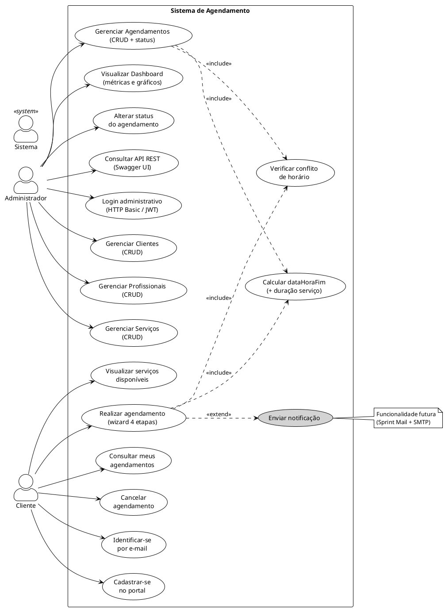
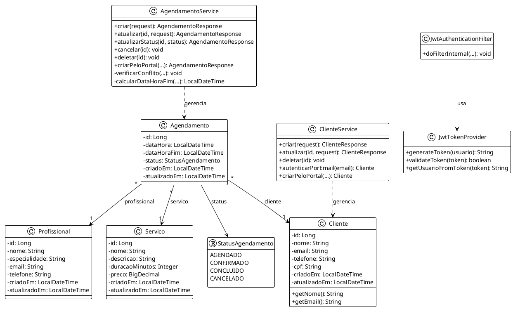
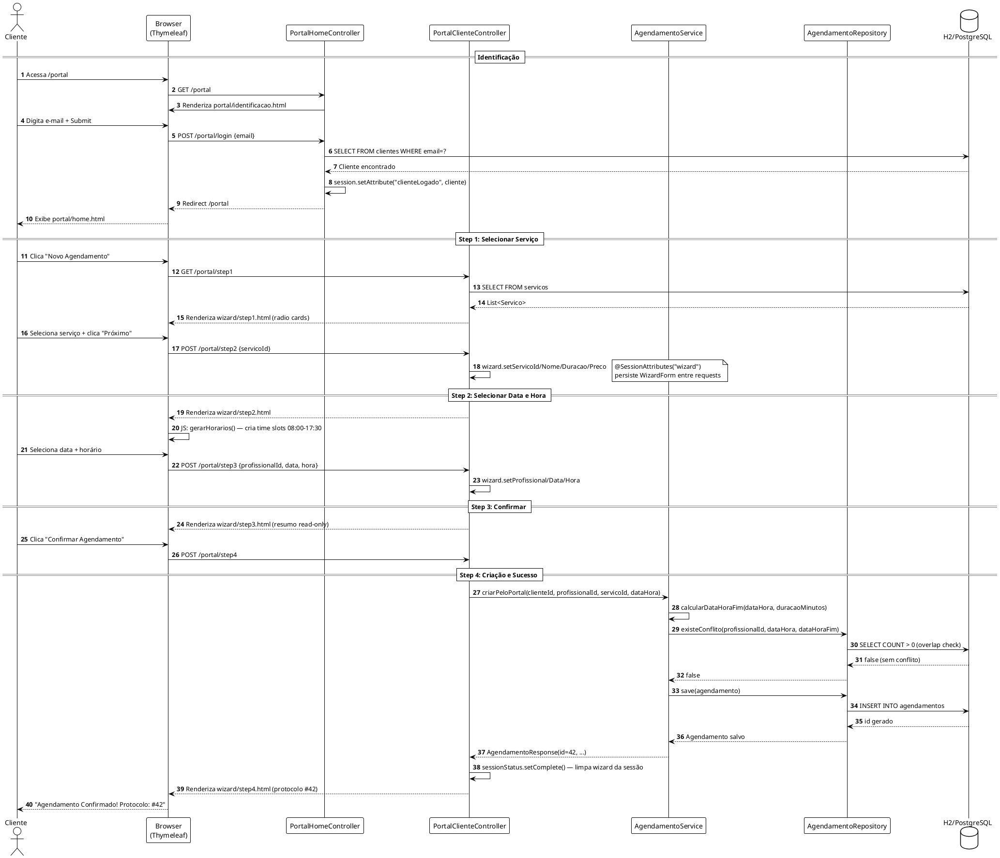
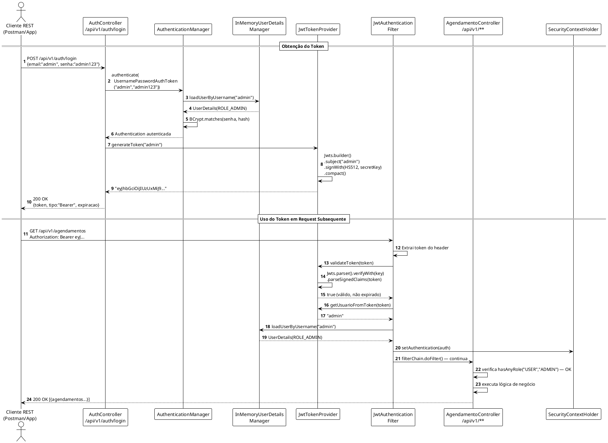
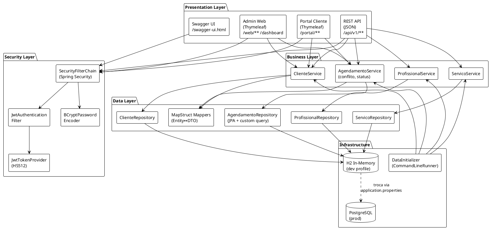
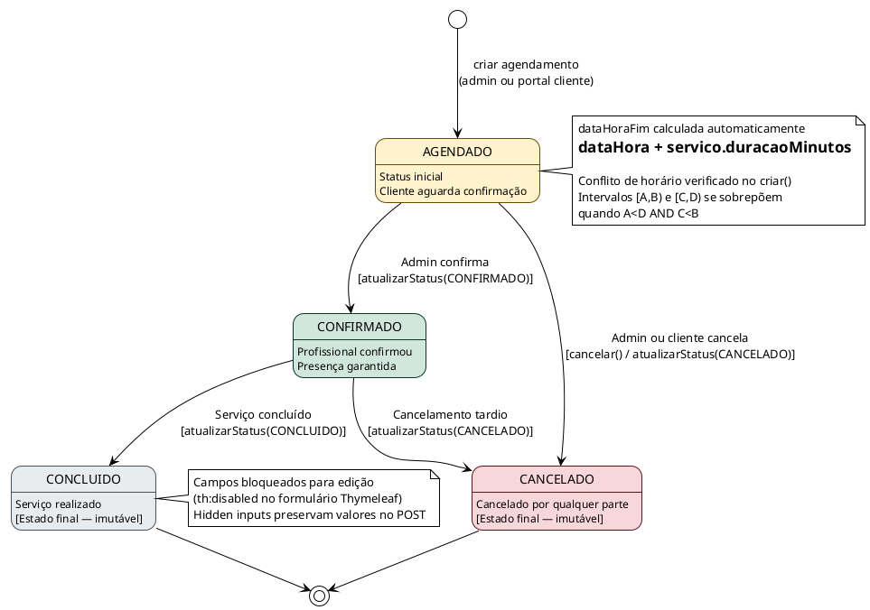
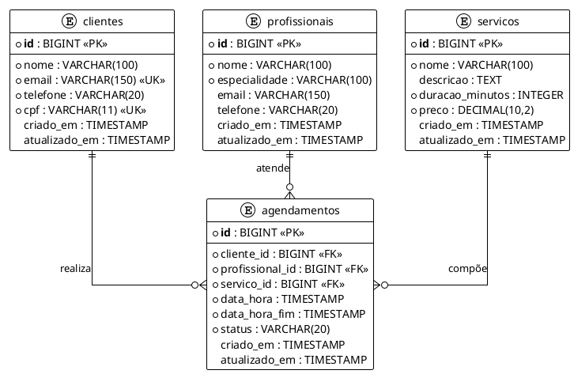
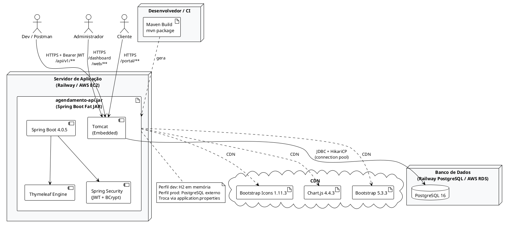

# Guia Completo de Diagramas UML — TCC Agendamento API
## Guilherme Braga — UNDB 2026

> **Como renderizar**: Cole cada bloco PlantUML em https://plantuml.com/plantuml
> ou use o plugin IntelliJ IDEA "PlantUML Integration" (File → Settings → Plugins → buscar "PlantUML").
> Para exportar PNG em alta resolução: no site online, clique em "PNG" após renderizar.

---

## DIAGRAMA 1 — Casos de Uso (Use Case)



---

## DIAGRAMA 2 — Diagrama de Classes (Domínio)



---

## DIAGRAMA 3 — Sequência: Wizard de Agendamento (Portal Cliente)



---

## DIAGRAMA 4 — Sequência: Autenticação JWT + API REST



---

## DIAGRAMA 5 — Componentes e Camadas



---

## DIAGRAMA 6 — Máquina de Estados do Agendamento



---

## DIAGRAMA 7 — Modelo Entidade-Relacionamento (Banco de Dados)



---

## DIAGRAMA 8 — Diagrama de Pacotes (Package Diagram)

```plantuml
@startuml TCC_Pacotes
!theme plain

package "com.guilhermebraga.agendamento_api" {
    package "config" {
        class SecurityConfig
        class DataInitializer
        class H2ConsoleConfig
    }
    package "controller" {
        package "web.controller" {
            class AgendamentoWebController
            class ClienteWebController
            class DashboardWebController
            class ProfissionalWebController
            class ServicoWebController
        }
        package "portal" {
            class PortalClienteController
            class PortalHomeController
            class PortalAgendamentoController
            class PortalMeusAgendamentosController
        }
        package "api" {
            class AgendamentoController
            class ClienteController
            class ProfissionalController
            class ServicoController
            class AuthController
        }
    }
    package "service" {
        class AgendamentoService
        class ClienteService
        class ProfissionalService
        class ServicoService
    }
    package "repository" {
        interface AgendamentoRepository
        interface ClienteRepository
        interface ProfissionalRepository
        interface ServicoRepository
    }
    package "entity" {
        class Agendamento
        class Cliente
        class Profissional
        class Servico
        enum StatusAgendamento
    }
    package "dto" {
        package "request" {
            class AgendamentoRequest
            class ClienteRequest
            class WizardForm
        }
        package "response" {
            class AgendamentoResponse
            class ClienteResponse
        }
    }
    package "mapper" {
        interface AgendamentoMapper
        interface ClienteMapper
    }
    package "security" {
        class JwtTokenProvider
        class JwtAuthenticationFilter
    }
    package "exception" {
        class BusinessException
        class ResourceNotFoundException
    }
}
@enduml
```



---

## DIAGRAMA 9 — Arquitetura de Deployment



---

## COMO GERAR OS DIAGRAMAS

### Opção 1 — Online (mais simples)
1. Acesse https://www.plantuml.com/plantuml/uml/
2. Cole o código PlantUML entre `@startuml` e `@enduml`
3. O diagrama é gerado automaticamente à direita
4. Para exportar: clique no ícone de download → escolha PNG ou SVG
5. **Resolução recomendada para TCC**: PNG em 2x (use o botão "PNG" diretamente)

### Opção 2 — IntelliJ IDEA Plugin
1. Settings → Plugins → buscar "PlantUML Integration" → instalar
2. Abra qualquer arquivo `.puml` ou cole o código em um arquivo `.puml`
3. O preview aparece ao lado automaticamente
4. Clique com botão direito → Export Diagram → PNG (300 DPI para impressão)

### Opção 3 — VS Code Extension
1. Extensions → buscar "PlantUML" (jebbs.plantuml)
2. Instalar Graphviz: https://graphviz.org/download/
3. Abra arquivo `.puml` → Alt+D para preview
4. Ctrl+Shift+P → "PlantUML: Export Current File Diagrams" → PNG

### Opção 4 — Maven (automatizado)
```xml
<!-- Adicionar ao pom.xml para gerar diagramas durante o build -->
<plugin>
    <groupId>com.github.funthomas424242</groupId>
    <artifactId>plantuml-maven-plugin</artifactId>
    <version>1.6.0</version>
</plugin>
```

---

## ONDE USAR CADA DIAGRAMA NO TCC

| Diagrama | Seção Recomendada | Título na Figura |
|---|---|---|
| 1. Casos de Uso | Cap 3 — Requisitos | Figura X: Diagrama de Casos de Uso |
| 2. Classes | Cap 4 — Desenvolvimento | Figura X: Diagrama de Classes do Domínio |
| 3. Sequência Wizard | Cap 4 — Wizard | Figura X: Diagrama de Sequência — Autoagendamento |
| 4. Sequência JWT | Cap 4 — Segurança | Figura X: Diagrama de Sequência — Autenticação JWT |
| 5. Componentes | Cap 4 — Arquitetura | Figura X: Diagrama de Componentes |
| 6. Máquina de Estados | Cap 4 — Negócio | Figura X: Máquina de Estados — Agendamento |
| 7. Modelo ER | Cap 3 — Banco de Dados | Figura X: Modelo Entidade-Relacionamento |
| 8. Pacotes | Cap 4 — Estrutura | Figura X: Diagrama de Pacotes |
| 9. Deployment | Cap 4 — Infraestrutura | Figura X: Diagrama de Implantação |

### Legenda ABNT para figuras
```
Figura X — [Título do Diagrama]
Fonte: Elaborado pelo autor (2026).
```

---

## DICAS PARA APRESENTAÇÃO (SLIDES / DEFESA)

- Use os diagramas 1 (casos de uso) e 5 (componentes) nos slides principais
- Use o diagrama 6 (máquina de estados) para explicar a regra de negócio de status
- Use o diagrama 3 (sequência wizard) para demonstrar o fluxo do cliente
- Use o diagrama 4 (sequência JWT) para explicar a segurança da API
- Para slides, prefira PNG fundo branco — visível em projetor
- Tamanho recomendado nos slides: centralizado, máximo 80% da largura do slide
